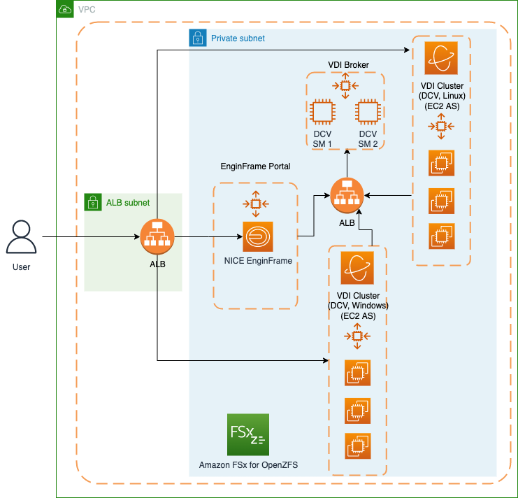

# An autoscaling VDI solution with EnginFrame and NICE DCV Session Manager

We will cover how to set up a fully functional autoscaling Linux and Windows virtual desktop infrastructure (VDI) 
that is accessible through a simple web-based user interface. The VDI solution solves for the problem of providing R&D users
with an easily accessible and performant user interface to submit graphics-intensive analysis requests, and review results remotely.
This eliminates the need for expensive dedicated workstations, or transferring large amounts of data from the cloud to client machines. 

The figure below shows the different components of the VDI solution. 
The architecture shows how a user interacts with EnginFrame to launch instances according to the Auto Scaling groups for Windows and Linux NICE DCV instances.
 


Install the CDK libraries enter the following:

```
$ cd elastic-vdi-infrastructure
$ python3 -m venv .venv
$ source .venv/bin/activate
$ pip3 install -r requirements.txt
```

Open the app.py file in your editor of choice and replace the "CHANGE_ME" string.

There are different parameters that you’ll need to configure:

 * `region`          The region of the deployment
 * `account`         The account id of the deployment
 * `key_name`        The Key Pairs used to access the instances
 * `cdk diff`        compare deployed stack with current state
 * `cdk docs`        open CDK documentation
 
The following additional parameters are available: 

 * `ec2_type_enginframe`               The EnginFrame instance type
 * `ec2_type_broker`                   The DCV Session Broker instance type
 * `ebs_enginframe_size`               The EBS size for the EnginFrame instance
 * `ebs_broker_size`                   The EBS size for the DCV session broker instance
 * `TagName and TagValue`              The billing tag used to tag the resources
 * `efadmin_uid`                       The UID of the efadmin user
 * `linux_shared_storage_size`         OpenZFS size in GiB
 * `Shared_Storage_Linux`              The mount point of the shared storage
 * `Enginframe_installer`              The EnginFrame download link
 * `Session_Manager_Broker_Installer`  The DCV session manager broker download link

Execute the following commands in sequence:

```
$ cdk bootstrap
$ cdk deploy Assets-Stack Parameters-Stack
$ cdk deploy Elastic-Vdi-Infrastructure
```

When the deployment is competed, The following two outputs are returned:

 * `Elastic-Vdi-Infrastructure.EnginFrameURL`                 The https address of the EnginFrame portal
 * `Elastic-Vdi-Infrastructure.SecretEFadminPassword`         The arn of the secret that contains the password of the EnginFrame administrator user (efadmin)

**Note**: a self signed certificate is generated for the HTTPS connection.


To deploy the linux and windows DCV fleet, the following two CloudFormation templates can be user:
  * `cloudformation_files/dcv-linux-fleet.yaml`          The Linux DCV fleet template
  * `cloudformation_files/dcv-windows-fleet.yaml`        The WIndows DCV fleet template
